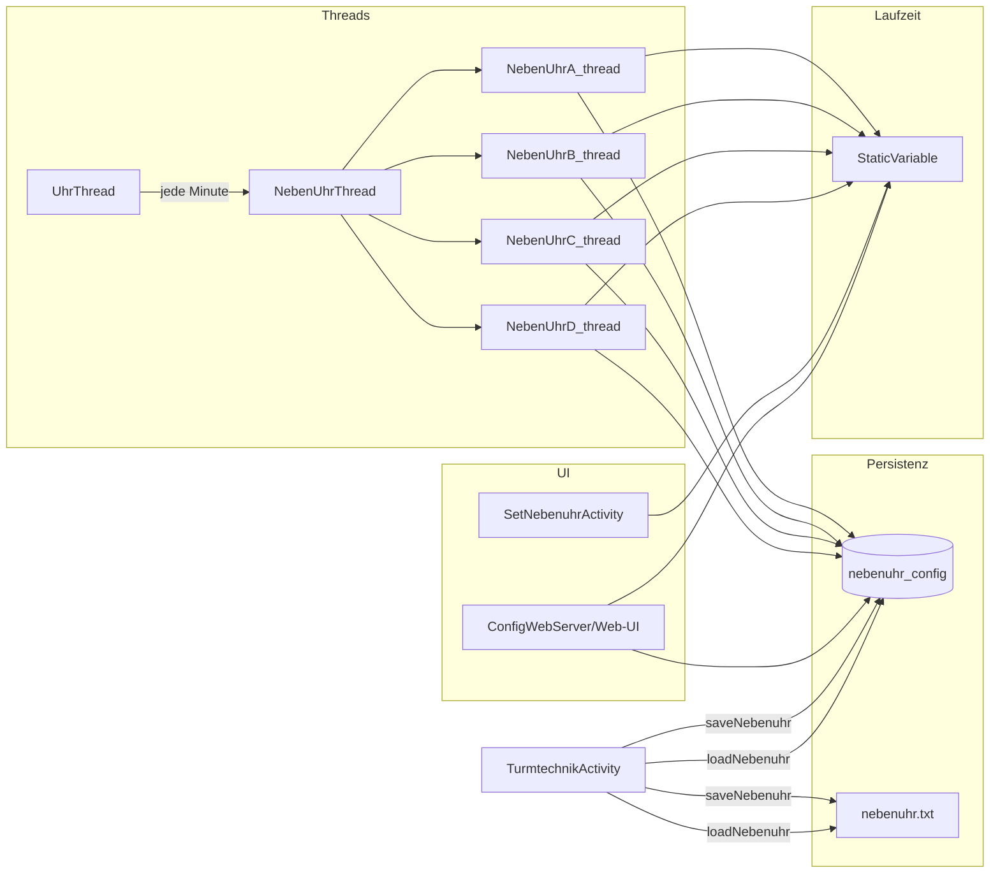

# Nebenuhr – Architektur und Datenflüsse

Diese Datei dokumentiert alle Komponenten, Speicherorte und Abläufe des Nebenuhr-Bereichs der Turmtechnik-App.

---

## 1. Übersicht

Der Nebenuhr-Code ist über viele Dateien verteilt. Es gibt **drei Speicherorte** für Laufzeit-/Persistenzdaten, **mehrere Threads** und **zwei UIs** (native Activity + Web-UI).

---

## 2. Zeile / Index-Zuordnung

| Zeile (DB/API) | Uhr   | Index in uhr_warten / uhr_zeiteingabeAktiv |
|----------------|-------|--------------------------------------------|
| 3              | A     | 0                                          |
| 4              | B     | 1                                          |
| 5              | C     | 2                                          |
| 6              | D (Monduhr) | 3                                    |

---

## 3. Komponenten und Verantwortung

| Datei | Rolle |
|-------|--------|
| `StaticVariable.java` | uhrA/B/C/D_* (calendarZeit, angezeigteZeit, doRun, lastRelaisA), uhr_warten, uhr_zeiteingabeAktiv, aufholenAnfordern, nebenuhrWaitFirstFullMinute, configNeuLaden |
| `PlatinenDatabaseHelper.java` | Tabelle `nebenuhr_config`, NebenuhrConfig, getNebenuhrByZeile, getAllNebenuhren, saveNebenuhr |
| `TurmtechnikActivity.java` | loadNebenuhr (Datei + DB), saveNebenuhr (Datei + DB), capNebenuhrAnzeigeToSollAndSave, Start-Check |
| `UhrThread.java` | minutenTakt++; startet jede Minute einen neuen NebenUhrThread |
| `NebenUhrThread.java` | incrementUhren(): Konfig aus DB, setWartenLaufen_A/B/C, Start A/B/C/D-Threads, restartNebenuhrIfNeeded |
| `NebenUhrA_thread.java` | Impuls-Schleife (Aufholen), makeOneImpuls, DB + StaticVariable (analog B, C) |
| `NebenUhrB_thread.java` | wie A für Uhr B |
| `NebenUhrC_thread.java` | wie A für Uhr C |
| `NebenUhrD_thread.java` | Monduhr (Phase 0–59), Impulse, StaticVariable.uhrD_* |
| `ConfigWebServer.java` | handleGetNebenuhren, handleNebenuhrStellenHold, handleNebenuhrStellenConfirm, nebenuhr-layout.html, restartNebenuhrIfNeeded-Aufruf |
| `SetNebenuhrActivity.java` | Native UI: TimePicker, uhr_zeiteingabeAktiv, uhrX_doRun |
| `SetNebenuhrLayout.java` | Native Layout-Anzeige |
| `LogTurmtechnik2.java` | Log-Zeile „Uhr A soll=… ist=…“ (nur aus StaticVariable) |
| `TimeConfig.java` | Zeitserver/GPS/Sonne (Nebenuhr-Duplikate uhrA/B/C_*, uhr_warten wurden entfernt; Nebenuhr nutzt ausschließlich StaticVariable.) |

---

## 4. Variable / Feld – Definition, Leser, Schreiber

### 4.1 StaticVariable (Laufzeit)

| Variable | Bedeutung | Gelesen von | Geschrieben von |
|----------|-----------|-------------|------------------|
| uhrA/B/C_calendarZeit | Soll-Zeit (12h, 0–719 Min.) | NebenUhrThread, NebenUhrX_thread, ConfigWebServer (confirm), loadNebenuhr | NebenUhrThread (incrementUhren), handleNebenuhrStellenConfirm, loadNebenuhr |
| uhrA/B/C_angezeigteZeit | Ist-Zeit (Anzeige) | NebenUhrThread, NebenUhrX_thread, saveNebenuhr, loadNebenuhr, handleGetNebenuhren | NebenUhrX_thread (makeOneImpuls), handleNebenuhrStellenConfirm, loadNebenuhr |
| uhrA/B/C_doRun | Thread soll laufen | NebenUhrX_thread, NebenUhrThread | NebenUhrThread, handleNebenuhrStellenHold, SetNebenuhrActivity, restartNebenuhrIfNeeded |
| uhrA/B/C_lastRelaisA | Wechselschaltung (letztes Relais A/B) | NebenUhrX_thread, saveNebenuhr | NebenUhrX_thread, loadNebenuhr |
| uhr_warten[0..3] | „Warten“ statt „Takten“ (Uhr voraus) | NebenUhrX_thread (checkSollIstZeit), NebenUhrThread | NebenUhrThread (setWartenLaufen_A/B/C), SetNebenuhrActivity |
| uhr_zeiteingabeAktiv[0..3] | Timepicker offen | NebenUhrThread, NebenUhrX_thread | handleNebenuhrStellenHold/Confirm, SetNebenuhrActivity |
| uhrA/B/C_aufholenAnfordern | Thread sofort wecken | NebenUhrX_thread (Sleep-Schleife) | handleNebenuhrStellenConfirm |
| nebenuhrWaitFirstFullMinute | Nach Load: erste volle Minute abwarten | NebenUhrThread (incrementUhren) | loadNebenuhr, loadNebenuhrLastRelaisAndAnzeigeFromDb |
| uhrD_* | Monduhr (Phase, doRun, …) | NebenUhrD_thread, handleGetNebenuhren, Confirm | NebenUhrThread, NebenUhrD_thread, handleNebenuhrStellenConfirm |

### 4.2 DB `nebenuhr_config`

| Feld | Bedeutung | Geschrieben von |
|------|-----------|------------------|
| angezeigte_zeit | Ist-Anzeige (A/B/C: 0–719; D: Phase 0–59) | Impuls-Threads A/B/C/D nach jedem Impuls; saveNebenuhr (mit Schutz); handleNebenuhrStellenConfirm; loadNebenuhr (capNebenuhrAnzeigeToSollAndSave) |
| last_relais_a | Wechselschaltung | Impuls-Threads; saveNebenuhr; loadNebenuhr; Confirm |
| mondphase_ist | Nur Zeile 6 (D) | NebenUhrD_thread; handleNebenuhrStellenConfirm |
| relais_a, relais_b, impuls_dauer_1/2, modus, aktiv, … | Konfiguration | Web-UI PUT /api/nebenuhren; Migration |

### 4.3 Datei `nebenuhr.txt`

- **Inhalt:** Drei Zeilen (A, B, C) mit angezeigte_zeit (eine Zahl pro Zeile).
- **Geschrieben von:** TurmtechnikActivity.saveNebenuhr() (jede Minute).
- **Gelesen von:** TurmtechnikActivity.loadNebenuhr() (App-Start / bei Bedarf).
- **Rolle:** Legacy/Backup. **Führende Quelle** für angezeigte_zeit und last_relais_a ist die **DB**; die Datei dient als zusätzliche Sicherung bzw. Fallback beim Laden.

---

## 5. Lebenszyklus

### 5.1 App-Start

1. TurmtechnikActivity lädt (z. B. bei Start-Check oder beim Öffnen der Nebenuhr-Seite) via **loadNebenuhr()**:
   - Liest `nebenuhr.txt` (uhrA, uhrB, uhrC).
   - Setzt StaticVariable.uhrA/B/C_angezeigteZeit (Datei), dann **DB überschreibt** (getNebenuhrByZeile) angezeigte_zeit und last_relais_a.
   - calendarZeit = aktuelle RTC (12h); **nebenuhrWaitFirstFullMinute = true**.
2. **capNebenuhrAnzeigeToSollAndSave**: Wenn Ist > Soll (Uhr voraus), wird Ist auf Soll begrenzt und in DB geschrieben.

### 5.2 Minuten-Takt (UhrThread)

1. Bei Minutenwechsel: **minutenTakt++**, neuer **NebenUhrThread** wird gestartet.
2. NebenUhrThread.run(): Lädt Konfig (getNebenuhrByZeile) aus DB, ruft **incrementUhren()** einmal auf.
3. incrementUhren():
   - Wenn **nebenuhrWaitFirstFullMinute**: calendarZeit = getCalendarMinuten(), setWartenLaufen_A/B/C.
   - Für A/B/C: calendarZeit aktualisieren (oder beim Aufholen stehen lassen); **uhr_warten** setzen; wenn **uhrX_doRun == false** und Zeiteingabe nicht aktiv → **uhrX_doRun = true**, NebenUhrX_thread starten.
   - D (Monduhr): Thread starten falls aktiv.

### 5.3 Impuls-Threads (Aufholen)

1. NebenUhrA/B/C_thread: while(uhrX_doRun) → while(checkSollIstZeit()) → makeOneImpuls() (Relais, dann StaticVariable.angezeigteZeit++, DB saveNebenuhr).
2. checkSollIstZeit(): true wenn angezeigteZeit != calendarZeit und !uhr_warten[index].
3. Wenn Gleichstand: Sleep bis nächste volle Minute (mit uhrX_aufholenAnfordern-Check).

### 5.4 Timepicker (Hold / Confirm)

- **Hold (Web: POST …/hold, Native: Dialog öffnet):** uhr_zeiteingabeAktiv[index] = true, uhrX_doRun = false → Thread beendet sich.
- **Confirm (Web: POST …/confirm, Native: Dialog OK):** angezeigteZeit = calendarZeit = gewählte Zeit; uhr_zeiteingabeAktiv[index] = false; DB aktualisiert; **NebenUhrThread.restartNebenuhrIfNeeded(context, index)** startet Thread sofort neu (ohne auf nächsten Minuten-Takt zu warten).

---

## 6. Schreibzugriffe und Races

### 6.1 Wer schreibt angezeigte_zeit / last_relais_a?

| Quelle | Wann | Anmerkung |
|--------|------|-----------|
| **Impuls-Threads A/B/C (und D)** | Nach jedem Impuls | StaticVariable + DB (saveNebenuhr). |
| **TurmtechnikActivity.saveNebenuhr()** | Jede Minute (Hauptthread) | Liest StaticVariable; schreibt DB + Datei. **Schutz:** Wenn DB-Wert bis zu 30 Minuten „voraus“ ist (Impuls-Thread war schneller), wird **nicht** mit älterem Wert überschrieben (nur lastRelaisA übernommen, angezeigte_zeit = DB-Wert). |
| **ConfigWebServer handleNebenuhrStellenConfirm** | Nach Zeitbestätigung (Web) | Setzt StaticVariable + DB; startet Thread neu. |
| **loadNebenuhr / loadNebenuhrLastRelaisAndAnzeigeFromDb** | Beim Start / bei Bedarf | Setzt StaticVariable aus Datei/DB; capNebenuhrAnzeigeToSollAndSave schreibt ggf. wieder in DB. |

### 6.2 Schreibregel (Races vermeiden)

- **Regel:** Die Minutenspeicherung (saveNebenuhr) darf den durch den Impuls-Thread erreichten Fortschritt nicht zurücksetzen. Daher: Wenn `config.angezeigteZeit` in der DB bereits höher ist als der gerade aus StaticVariable gelesene Wert und die Differenz ≤ 30 Minuten ist, wird der **DB-Wert** beibehalten (Impuls-Thread war schneller). Sonst wird der StaticVariable-Wert geschrieben.

---

## 7. APIs (Web-UI)

| Methode | Pfad | Bedeutung |
|---------|------|-----------|
| GET | /api/nebenuhren | Liefert alle Nebenuhren (Konfig + live angezeigte_zeit / mondphase_ist aus StaticVariable). |
| PUT | /api/nebenuhren | Speichert Nebenuhr-Konfigurationen (Body: JSON mit nebenuhren-Array). |
| POST | /api/nebenuhr-stellen/hold | Body: zeile (3–6). Setzt uhr_zeiteingabeAktiv, stoppt Thread (uhrX_doRun = false). |
| POST | /api/nebenuhr-stellen/confirm | Body A/B/C: zeile, stunde, minute (24h). Body D: zeile, mondphase (0–59). Setzt Zeit/Phase in StaticVariable + DB, uhr_zeiteingabeAktiv = false, ruft restartNebenuhrIfNeeded auf. |

---

## 8. Redundanzen (Kurz)

- **TimeConfig:** Die ehemaligen Duplikate uhrA/B/C_* und uhr_warten wurden entfernt (ungenutzt; Nebenuhr nutzt nur StaticVariable). TimeConfig enthält nur noch Zeitserver-/GPS-/Sonne-Felder (diese werden in der App über StaticVariable genutzt).
- **Datei vs. DB:** DB ist die führende Quelle für angezeigte_zeit und last_relais_a; die Datei `nebenuhr.txt` ist Legacy/Backup.
